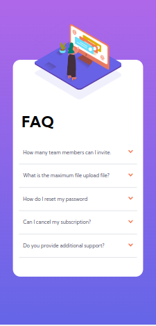

# Frontend Mentor - FAQ accordion card solution

This is a solution to the [FAQ accordion card challenge on Frontend Mentor](https://www.frontendmentor.io/challenges/faq-accordion-card-XlyjD0Oam). Frontend Mentor challenges help you improve your coding skills by building realistic projects. 

## Table of contents

- [Overview](#overview)
  - [The challenge](#the-challenge)
  - [Screenshot](#screenshot)
  - [Links](#links)
- [My process](#my-process)
  - [Built with](#built-with)
- [Author](#author)

## Overview

### The challenge

Users should be able to:

- View the optimal layout for the component depending on their device's screen size
- See hover states for all interactive elements on the page
- Hide/Show the answer to a question when the question is clicked

### Screenshot

### Links

- Solution URL: [Netflify link](https://cool-bunny-a2d35c.netlify.app/)
- Live Site URL: [GitHub link](https://github.com/Alan08t/FAQ-accordion/tree/master/build)

## My process

In this project I decide to introduce new tools for me and practice Tailwind with ReactJS.
### Built with

- Semantic HTML5 markup
- CSS custom properties
- Flexbox
- Mobile-first workflow
- [React](https://reactjs.org/) - JS library
- [Tailwind](https://tailwindcss.com/) - CSS tool

## Author

Website - Hi! i'm Alan!
Frontend Mentor - @Alan08t
Twitter - @alan_torino
Linkedin - Alan Torino
